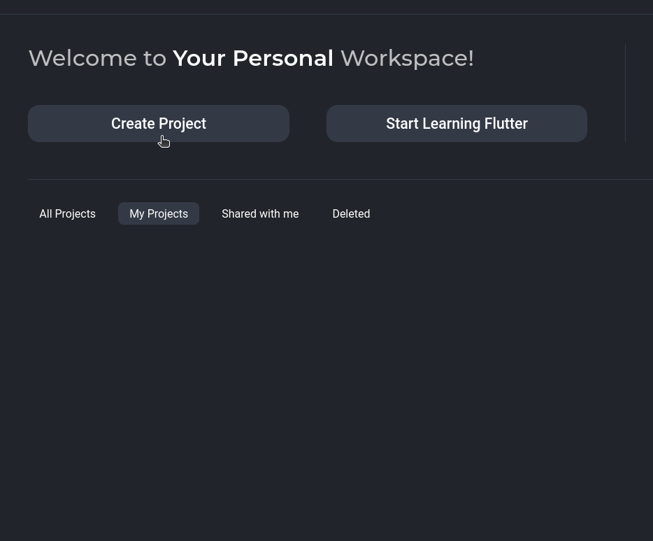
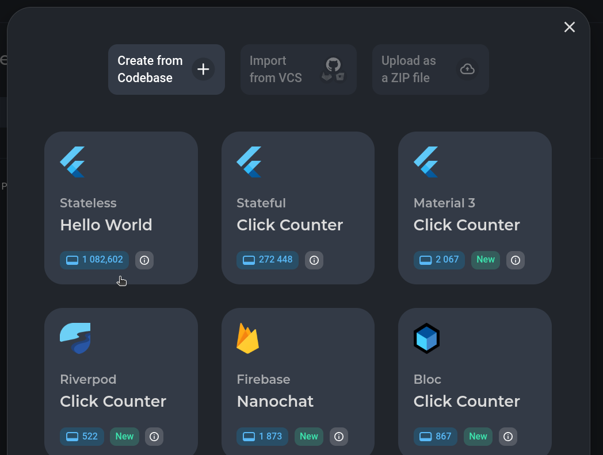
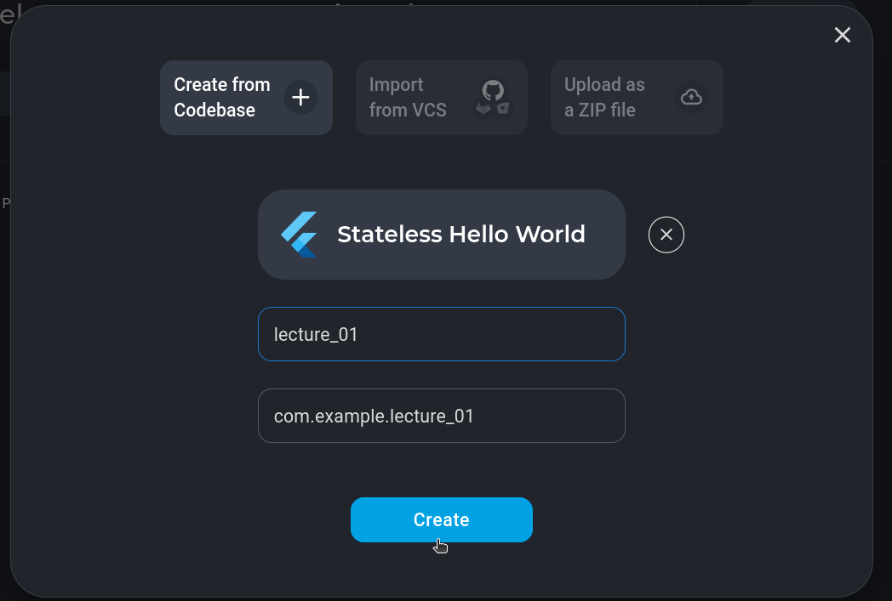
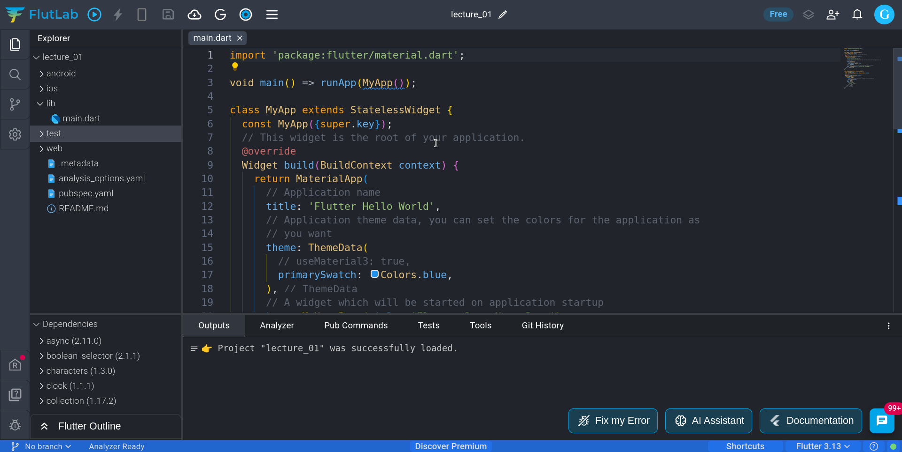
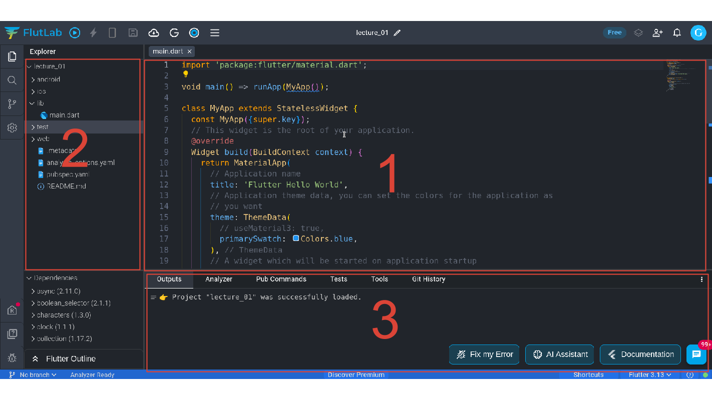
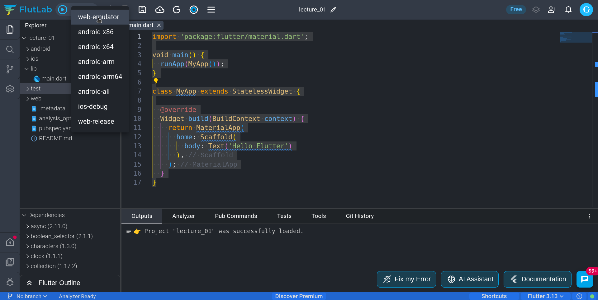
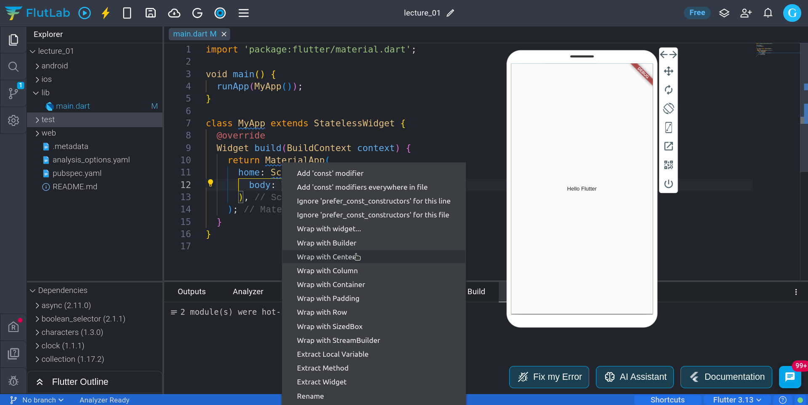
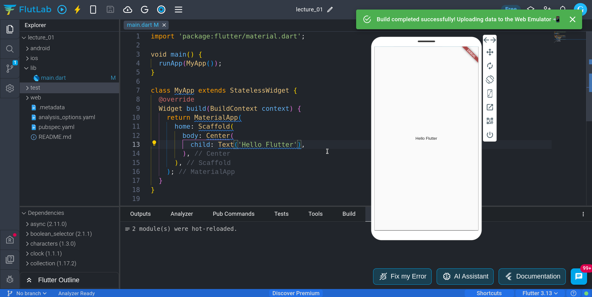
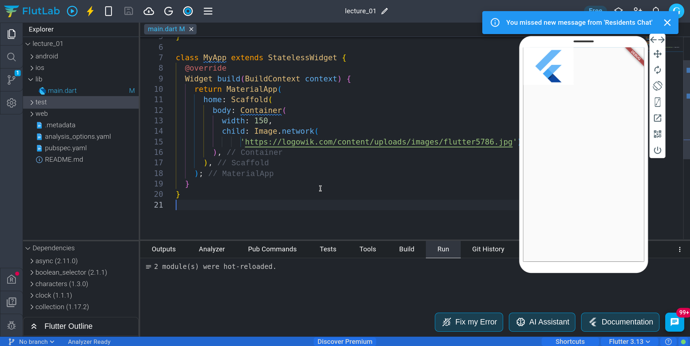

## Flutlab პლატფორმის გაცნობა
როგორც უკვე იცით, Flutter_ის შესასწავლად ჩვენ გამოვიყენებთ ონლაინ პლატფორმას [Flutlab.io](https://flutlab.io/). გადადი მოცემულ ლინკზე და დარეგისტრირდი პლატფორმაზე, ამის შემდეგ შენ აღმოჩნდები ეგრედწოდებულ workspace_ზე სადაც მომავალში შენს მიერ შექმნილი პროექტები გამოჩნდება. ახალ კი მოდით შევქმნათ ჩვენი პირველი პროექტი. 

1. დააჭირე create project ღილაკს



2. ეკრანზე გამოსულ ფანჯარაში აირჩიე Hello World პროექტი



3. შეურჩიე პროექტს შენთვის სასურველი სახელი და დააჭირე create ღილაკს



4. პროექტის შექმნის შემდეგ ის ჩვენს Workspace_ში გამოჩნდება. მასზე დაჭერის შემდეგ კი ჩვენი ახლად შექმნილი პროექტი გაიხსნება


პროექტის გახსნის შემდეგ გამოჩნდება Flutlab_ის ინტერფეისი:



როგორც უკვე შეატყვე ეს ინტერფეისი რამდენიმე მინი ფანჯრისაგან შედგება:



მოდით მოკლედ განვიხილოთ ჩვენთის საჭირო სამი ფანჯარა, ესენია: 

1. კოდ ედიტორი - ამ ფანჯარაში შევძლებთ დარტ პროგრამირების ენის დახმარებით პრექტის კოდის დაწერას.
2. პროექტის ფაილები - ამ ფანჯარაში მოცემული გვაქვს პროექტის ფაილები და ფოლდერები
3. კონსოლი - დამხმარე ფანჯარა, რომელიც Flutlab_ის რამდენიმე ფუნქციონალის გამოყენების საშვალებას გვაძლევს


## დაგენერირებული პროექტის კოდის 'გასუფთავება'
იმის მიუხედავად, რომ ჩვენ ყველაზე მარტივი Hello World პრექტი ავირჩიეთ პროექტის შექმნისას, Flutlab_მა საკმაოდ დიდი მოცულობის კოდი დაგვიგენერირა. ამიტომ მოდით წავშალოთ კოდის ის ნაწილები, რომელიც ჯერჯერობით ჩვენ არ გვჭირდება.

Flutlab_ის დაგენერირებული Hello World პროექტი:

```dart
import 'package:flutter/material.dart';

void main() => runApp(MyApp());

class MyApp extends StatelessWidget {
  const MyApp({super.key});
  // This widget is the root of your application.
  @override
  Widget build(BuildContext context) {
    return MaterialApp(
      // Application name
      title: 'Flutter Hello World',
      // Application theme data, you can set the colors for the application as
      // you want
      theme: ThemeData(
        // useMaterial3: true,
        primarySwatch: Colors.blue,
      ),
      // A widget which will be started on application startup
      home: MyHomePage(title: 'Flutter Demo Home Page'),
    );
  }
}

class MyHomePage extends StatelessWidget {
  final String title;
  const MyHomePage({super.key, required this.title});  

  @override
  Widget build(BuildContext context) {
    return Scaffold(
      appBar: AppBar(
        // The title text which will be shown on the action bar
        title: Text(title),
      ),
      body: Center(
        child: Text(
          'Hello, World!',
        ),
      ),
    );
  }
}

```

ზემოთ მოცემული მაგალითის ჩვენთვის არა საჭირო ფრაგმენტების გასუფთავების შემდეგ მივიღებთ პროგრამის კოდს რომელიც იქნება ჩვენი საწყისი კოდი ამ კურსის განმავლობაში:

```dart
import 'package:flutter/material.dart';

void main() {
  runApp(MyApp());
}

class MyApp extends StatelessWidget {

  @override
  Widget build(BuildContext context) {
    return MaterialApp(
      home: Scaffold(),
    );
  }
}

```

მიაქციე ყურადღება Scaffold ვიჯეტს. სწორედ Scaffold ვიჯეტში შევქმნით აპლიკაციის ვიზუალურ ნაწილს საწყისი რამდენიმე გაკვეთილის განმავლობაში.

## რა არის ვიჯეტი?
Flutter_ში ვიჯეტი არის ის ელემენტი, რომლითაც "ვაშენებთ" მომხმარებლის ინტერფეისს (UI). ვიჯეტი შეიძლება იყოს მარტივი ვიზუალური ეფექტი (მაგალითად Text ვიჯეტი) ან შედარებით კომპლექსური ლეიაუთ-ვიჯეტი, რომელიც სხვა ვიჯეტების ეკრანზე სპეციფიურ განლაგებაში გვეხმარება(მაგალითად Column ვიჯეტი). ასევე გვაქვს ვიჯეტები, რომელთაც არანაირი ვიზუალური ეფექტი/დანიშნულება არ აქვთ, ასეთი ვიჯეტები გამოიყენება აპლიკაციის ზოგადი კონფიგურებისათვის (მაგალითად MaterialApp, Scaffold ...).

## import ინსტრუქცია
ჩვენი პროექტის საწყისი კოდის პირველი ინსტრუქცია გახლავთ ეგრედ წოდებული import ინსტრუქცია. დარტის შესწავლისას ჩვენ მხოლოდ ერთ ფაილთან გვქონდა შეხება. (Dartpad_ში ახალი ფაილის დამატების ფუნქციონალი საერთოდ არ გვაქვს). თუმცა როგორც წესი პროგრამის კოდი მრავალი ფოლდერისა და ფაილისაგან შედგება. იმისათვის, რომ ერთ ფაილში შევძლოთ სხვა ფაილში აღწერილი ფუნქციების, ცვლადებისა და კლასების შემოტანა ჩვენ ისინი უნდა 'დავაიმპორტოთ'. ასევე შეგვიძლია ჩვენს პროექტში შემოვიტანოთ კოდი, რომელიც ჩვენი დაწერილი სულაც არ არის. მაგალითად კოდი რომელიც Flutter_ის დეველოპერებმა შექმნეს. სწორად ამას აკეთებს ჩვენს კოდში არსებული import ინსტრუქცია.

import ინსტრუქცია ყოველთვის მოცემული გვაქვს ფაილის დასაწყისში და ის შედგება import keyword_ისაგან და მისამართისგან სადაც ეს ფაილი მდებარეობს.

```dart
import 'package:flutter/material.dart';
```

## MaterialApp ვიჯეტი

MaterialApp ვიჯეტი საშვალებას გვაძლევს ჩვენს პროექტში მივუთითოთ ისეთი კონფიგურაციის ელემენტები, რომელიც სრულიად მთლიან აპს ეხება და არა რომელიმე კონკრეტულ ეკრანს.
MaterialApp ვიჯეტი აპლიკაციაში არის მხოლოდ ერთი. ამ ვიჯეტზე და მის პარამეტრებზე მომავალში ბევრს ვისაუბრებთ, თუმცა ჯერჯერობით გვჭირდება ერთადერთი პარამეტრი home, რომელსაც ჩვენ უნდა გადავცეთ იმ ვიჯეტის/ეკრანის სახელი რომელიც აპლიკაციის ჩართვისას პირველად დაიხატება.

## Scaffold ვიჯეტი
Scaffold ვიჯეტი პასუხისმგებელია ერთი კონკრეტული ეკრანის დახატვაზე Flutter_ში. ის შეგვიძლია შევადაროთ Screen კომპონენტს App Inventor_იდან. Scaffold ვიჯეტს რამდენიმე მნიშვნელოვანი პარამეტრი აქვს, რომელთაც ამ კურსის განმავლობაში შევისწავლით:

- appBar - როგორც წესი აპლიკაციის ზედა ნაწილში მოთავსებული ელემენტი, რომელიც გვეხმარება : აპლიკაციის სათაურის ჩვენებაში, სხვადასხვა აპლიკაციის ძირითადი ფუნქციონალის მარტივად გამოსახვაში(notifications, messages, და სხვა...)

- BottomNavigationBar - როგორც წესი მოცემულია აპლიკაციის ქვედა ნაწილში და გვაძლევს ნავიგაციის საშვალებას აპლიკაციის სხვადასხვა გვერდზე.

- floatingActionButton - როგორც წესი მოთავსებულია აპლიკაციის ქვედა მარჯვენა ნაწილში და მოცემული გვერდის მთავარ ფუნქციონალზე გვაძლევს სწრაფ წვდომას.(მაგალითად Gmail_ის აპლიკაციაში ახალი მეილის შექმნა)

Scaffold ვიჯეტის ზემოთ ხსენებულ პარამეტრზებზე კურსის განმავლობაში ვისაუბრებთ, ჯერჯერობით კი მხოლოდ Scaffold ვიჯეტის body პარამეტრი გვჭირდება:


body - ეკრანის/გვერდის მთავარი ნაწილი სადაც სხვა ვიჯეტების დახმარებით ვაწყობთ User Interface_ს


## Text ვიჯეტი

Text ვიჯეტი ყველაზე ხშირად გამოყენებადი Flutter ვიჯეტია. Text ვიჯეტის დანიშნულებაა დაარენდეროს(ეკრანზე ასახოს) მოცემული string_ი. Text ვიჯეტს ასევე შეუძლია ამ string_ის ფერის, ფონტის, ზომის, და სხვა მახასიათებლების კონტროლი. ახლა ვნახოთ როგორ გამოიყურება Text ვიჯეტი Scaffold ვიჯეტის body პარამეტრში:

```dart
import 'package:flutter/material.dart';

void main() {
  runApp(MyApp());
}

class MyApp extends StatelessWidget {

  @override
  Widget build(BuildContext context) {
    return MaterialApp(
      home: Scaffold(
        body: Text('Hello Flutter')
      ),
    );
  }
}

```

მოცემული პროგრამის გასაშვებათ და ემულატორის ეკრანზე სანახავად:
- მაუსი მიიტანე play ღილაკთან ეკრანის ზედა მარცხენა კუთხეში
- ჩამოშალე build მენიუ და აირჩიე web-emulator (როგორც წესი default_ად სწორად web-emulator_ი იქნება მონიშნული)
- ამჯერად დააჭირე play ღილაკს, ამის შემდეგ flutlab_ი 'ააშენებს' ჩვენს პროექტს და გაუშვებს მას ემულატორში



რამდენიმე წამის შემდეგ ეკრანზე გამოჩნდება ემულატორის ეკრანი, ემულატორის ზედა მარცხენა კუთხეში კი ჩვენი Text ვიჯეტი.


## Flutlab_ის wrap ფუნქციონალი

ხშირად Flutter_ში აპლიკაციების შექმნისას გვიწევს ერთი ვიჯეტის მეორეში ჩასმა, ან პირიქით რომელიმე ვიჯეტის იერარქიიდან ამოღება. ამის გაკეთება ხელითაც შეგვიძლია თუმცა ეს ხშირად სხვადასხვა სინტაქსურ შეცდომებს იწვევს. Flutlab_ს და ზოგადად Flutter_ში გვქვს დამხმარე ფუნქციონალი რომელიც მსგავსი მოქმედებების შესრულებას გვიმარტივებს. მაგალითად იმისათვის, რომ Text ვიჯეტი მოვათავსოთ Center ვიჯეტში(Center ვიჯეტზე შემდეგ თავში ვისაუბრებთ) კურსორი მოათავს Text ვიჯეტზე და კლავიატურაზე ერთდროულად დააჭირე ctrl და .(წერილი) ღილაკებს ამის შემდეგ გამოჩნდება მენიუ სადაც აირჩიე wrap with center. ამის შემდეგ აღმოაჩენ რომ ჩვენს კოდში Text ვიჯეტი 'ჩაჯდა' Center ვიჯეტის child პარამეტრის მნიშვნელობად



## Center ვიჯეტი
Center ვიჯეტი ფლატერში გამოიყენება ვიჯეტების გასაცენტრად ჰორიზონტალურ და ვერტიკალურ ღერძზე მშობელი ვიჯეტის საზღვრებში. ქვემოთ მოცემულია კოდი და შესაბამისი ვიზუალი Text ვიჯეტის რომელიც Center ვიჯეტის დახმარებით მოვათავსეთ ეკრანის ცენტრში.

```dart
import 'package:flutter/material.dart';

void main() {
  runApp(MyApp());
}

class MyApp extends StatelessWidget {
  @override
  Widget build(BuildContext context) {
    return MaterialApp(
      home: Scaffold(
        body: Center(
          child: Text('Hello Flutter'),
        ),
      ),
    );
  }
}

```


იმისათვის, რომ ვნახოთ კოდის ცვლილების შედეგი ემულატორში კლავიატურაზე დააჭირე ctrl და S ღილაკებს ერთდროულად. ამის შემდეგ ეს ცვლილებები შეინახება პროექტში და გაეშვება ემულატორშიც.



## ტექსტის სტილები

ახლა კი მოდით ვნახოთ როგორ შეგვიძლია ტექსტის ფონტის ზომისა და ფერის შეცვლა FLutter_ში. ამისთვის ჩვენ Text ვიჯეტის style პარამეტრს გამოვიყენებთ:

```dart
import 'package:flutter/material.dart';

void main() {
  runApp(MyApp());
}

class MyApp extends StatelessWidget {
  @override
  Widget build(BuildContext context) {
    return MaterialApp(
      home: Scaffold(
        body: Center(
          child: Text(
            'Hello Flutter',
            style: TextStyle(
              fontSize: 22,
              color: Colors.blue,
            ),
          ),
        ),
      ),
    );
  }
}

```

ამ მაგალითში:
- Text ვიჯეტის კონსტრუქტორს ტექსტთან ერთად გადავცემთ მეორე პარამეტრს სახელად style
- style პარამეტრის მნიშვნელობა გახლავთ TextStyle ტიპის ობიექტი
- TextStyle ობიექტში გვაქვს ორი პარამეტრი fontSize და color
- fontSize პარამეტრის მნიშვნელობა არის 22 ერთეული (default მნიშვნელობა არის 14)
- color პარამეტრს კი Colors კლასში წინასწარ აღწერილი ფერებიდან ერთერთს გადავაწოდებთ.


## Image ვიჯეტი
Image ვიჯეტი ფლატერში საშვალებას გვაძლევს აპლიკაციაში შემოვიტანოთ სურათები. სურათი შეიძლება შემოვიტანოთ პროექტის ფაილებიდან ანდა სურათის ინტერნეტ მისამართის დახმარებით. ჯერჯერობით სწორედ ინტერნეტ მისამართის საშვალებით ვნახავთ როგორ შეგვიძლია სურათის შემოტანა ჩვენს აპლიკაციაში. ამისათვის გამოვიყენებთ Image ვიჯეტის ფუნქციას სახელად network რომლელსაც პარამეტრად უნდა გადავაწოდოთ სტრინგი - სურათის მისამართი. ქვემოთ მოცემულია Image ვიჯეტის მაგალითის კოდი და ამ კოდის შედეგი ემულატორში:

```dart
import 'package:flutter/material.dart';

void main() {
  runApp(MyApp());
}

class MyApp extends StatelessWidget {
  @override
  Widget build(BuildContext context) {
    return MaterialApp(
      home: Scaffold(
        body: Image.network(
            'https://logowik.com/content/uploads/images/flutter5786.jpg'),
      ),
    );
  }
}


```


## Container ვიჯეტი
Container ვიჯეტი ფლატერში სხვადასხვა დანიშნულებით შეგვიძლია გამოვიყენოთ. მაგალითად:
- რაიმე ვიჯეტის კონკრეტული ზომების მისათითებლად
- ვიჯეტისათვის პადინგების დასამატებლად
- ვიჯეტისათვის მარჯინების დასამატებლად
- ვიჯეტის უკანაფონის ფერის შესაცვლელად 

ზემოთ ხსენებულის გარდა Container ვიჯეტს კიდევ ბევრი ფუნქციონალი გააჩნია რომელთა ნაწილს შემდეგ გაკვეთილში შევისწავლით. ახლა კი ვნახოთ როგორ შეგვიძლია Container ვიჯეტის დახმარებით ჩვენი სურაის ზომების გაწერა


```dart
import 'package:flutter/material.dart';

void main() {
  runApp(MyApp());
}

class MyApp extends StatelessWidget {
  @override
  Widget build(BuildContext context) {
    return MaterialApp(
      home: Scaffold(
        body: Container(
          width: 150,
          child: Image.network(
              'https://logowik.com/content/uploads/images/flutter5786.jpg'),
        ),
      ),
    );
  }
}


```

!!! Image ვიჯეტის Container ვიჯეტში ჩასასმელად გამოიყენე Flutter_ის wrap ფუნქციონალი - (ctrl + .)

მოცემულ მაგალითში Container ვიჯეტის დახმარებით სურათის სიგანე მივუთითეთ (150 ერთეული). მიაქციე ყურადღება, რომ სურათი სიმაღლეში პროპორციულად დაპატარავდა.




